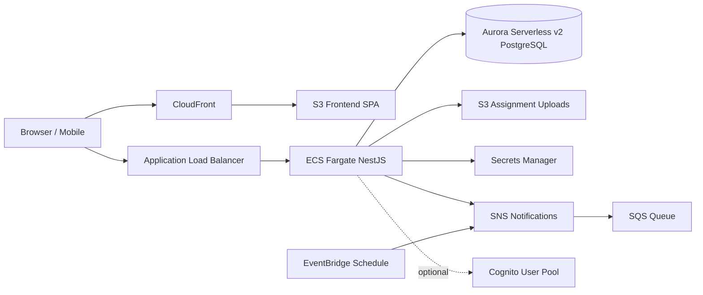

# Architecture

## System context

## Request paths

| Path | Components |
|------|------------|
| Static UI | CloudFront → S3 (OAC, SPA fallback to `index.html`) |
| API | ALB → ECS tasks (private subnets) → Aurora |
| Uploads | Browser → pre-signed S3 URL (CORS) or API multipart |
| Async notify | API → SNS → SQS → worker / in-process consumer |
| Reminders | EventBridge cron → SNS (stub payload) |

## Auth

Primary: NestJS issues JWT access + refresh tokens (`JWT_SECRET` / `JWT_REFRESH_SECRET` in Secrets Manager).

Optional: Cognito User Pool (`enableCognito` in env config) for hosted UI / federation; NestJS remains the API authorizer unless you switch guards.

## Compute alternative

ECS Fargate is default. Lambda + API Gateway is documented in `infra/README.md` for spiky, short-lived workloads.
